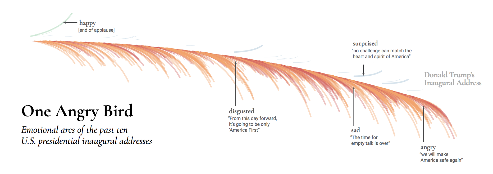
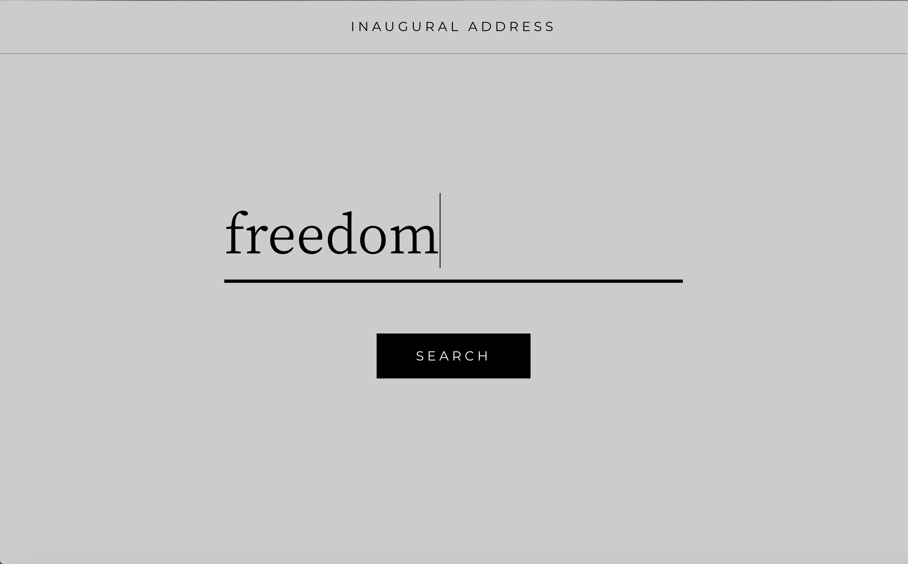
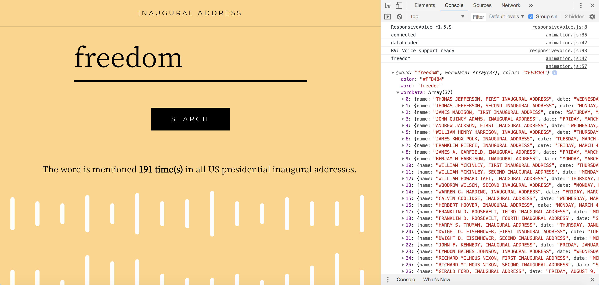
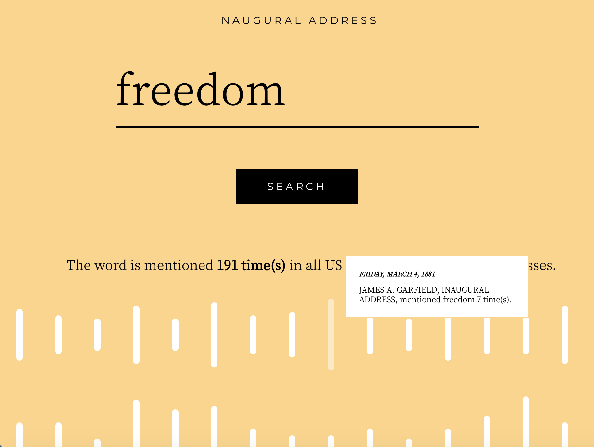

# Inaugural Address
By James Huang, Alan Peng, Heng Tang

## Inspiration
Since the project wants us to get some archives, the first thing came up to our mind is somebody’s speech/talk. Also, the midterm election is approaching, we want to make something from talks made by politicians. After that, we saw this page: [One Angry Bird](https://emotions.periscopic.com/inauguration/). This page visualizes the emotions from detecting the facial expression of US presidents during the presidential inaugural addresses. 



Inspired by this, we took all the inaugural addresses of every US presidents and try to count how many times each word is being mentioned. By knowing how many times a certain word is mentioned, we may discover some trends or something is focused at that time. 

## Implementation
### Node.js, Server-Client socket.io
We made a **server-client socket** node application. The server side analyze the text and get the word count of every single words, then it will wait for the client side to query the word they type in. The server will send the result data to client so that the client can visualize the data based on the returned message.


### Word “Dictionary” and ResponsiveVoiceJS
The result chart will come up with bars and sound. The length of a bar represents how many times it is mentioned in one single address. (Note that we don’t draw the bar if it mentioned 0 time.) To get the count of each word, we followed the example made by Dan Shiffman in [A2Z-F18/concordance.js at master · shiffman/A2Z-F18 · GitHub](https://github.com/shiffman/A2Z-F18/blob/master/week5-analysis/01_concordance/concordance.js). As to the sound, there will come up with some voice reading out the query word. If the word is mentioned more, the pitch of the speaking sound will be higher. Here we use [API - ResponsiveVoice.JS | ResponsiveVoice.JS](https://responsivevoice.org/api/) to make this job done. 

### Word2Vec
Moreover, the background color will change according to the word you query. We set 5 emotions with a specific color respectively.
```
const emotions = [
  wordVec.vectors['happy'],
  wordVec.vectors['surprise'],
  wordVec.vectors['angry'],
  wordVec.vectors['sad'],
  wordVec.vectors['hope']
]
const emotionColor = [
  '#FFD484',
  '#C4B1DE',
  '#FF564C',
  '#91AA9D',
  '#F9B1B1'
]
```
Then we get the word vector from the word model provided by [word2vec() · ml5js](https://ml5js.org/docs/Word2vec) in this page: [ml5-examples/p5js/Word2Vec/data at master · ml5js/ml5-examples · GitHub](https://github.com/ml5js/ml5-examples/tree/master/p5js/Word2Vec/data).  So we compare the “distance” between the query word and emotions we provided, the background color will be decided by calculating which emotion is the “nearest” to the query word.