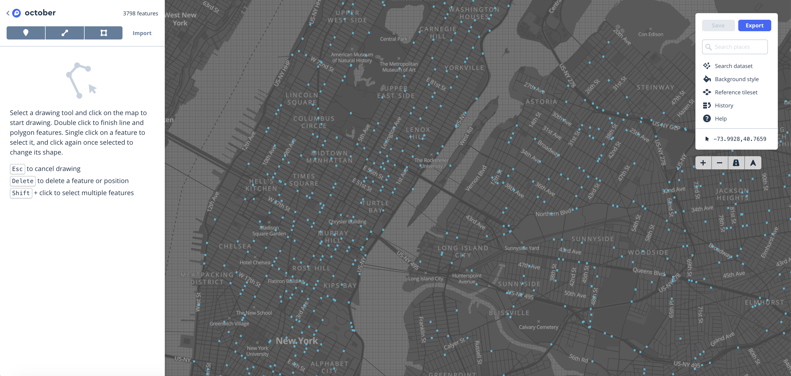

# Map of Virtual and Physical Reality
By Alan Peng and James Huang

## Inspiration
From the discussion in last 2 weeks, we have discussed about what kind of form can a map be. So we try to imagine what a map will be in next generation.  In recent years, topics that most representing “future” will be **VR/AR** and **Machine Learning**. Among these new technologies,  applying AR on maps seems to be more and more popular like Pokemon GO and [Google Maps AR](https://www.youtube.com/watch?v=4F0gFpzsYLM). 

Accordingly, we want to explore more on visualizing spatial data by AR so that a map can not only showing directions and shops but more various information.

## Approaching
We tried to make a simple AR app by using [Unity ARKit](https://bitbucket.org/Unity-Technologies/unity-arkit-plugin?fbclid=IwAR1nN4j4wpmcikztBXB57birFemRU1j7gDCDbVgOEJTsdqZ1cGKqGQSAmvo) and [Mapbox Unity SDK](https://www.mapbox.com/unity-sdk/maps/overview/?fbclid=IwAR3FL2Geay5MZMJpkn4Tb2asKbwIGAW67KRDnhtcej8FkzedrjT50Bb9k-E) with the data from [NYPD Motor Vehicle Collisions | NYC Open Data](https://data.cityofnewyork.us/Public-Safety/NYPD-Motor-Vehicle-Collisions/h9gi-nx95)

### Data Cleaning
Since the dataset is really huge (1.38M of collisions since 2014, with 29 columns of detail data), it will be a disaster if we put everything on the map.


So we wrote a Python script to get the data only in 2018/10 and simplified it with **Date, Lat, Lng, Street Name, People Injured and Killed**. Also, we skipped the data with no casualty. Then we output the data as a **Geojson** file.

Also, we want to show the data of people injured and killed in a 3d polygon. However, Unity cannot draw a 3d polygon with a point data, so we tried to calculate a small area from the lat-lng point and output the geojson data with a **Polygon** type.
```
# Turn a point into a small rectangle
coordinates = [[
    [float(data[2])-0.0001, float(data[1])-0.0001],
    [float(data[2])-0.0001, float(data[1])+0.0001],
    [float(data[2])+0.0001, float(data[1])+0.0001],
    [float(data[2])+0.0001, float(data[1])-0.0001],
    [float(data[2])-0.0001, float(data[1])-0.0001]
    ]]
```

```
# Processed Data for one accident
        {
            "type": "Feature",
            "style": {
                "fill": "red",
                "stroke-width": 1,
                "fill-opacity": 0.6
            },
            "geometry": {
                "type": "Polygon",
                "coordinates": [
                    [
                        [
                            -73.937745,
                            40.812644
                        ],
                        [
                            -73.937745,
                            40.812844000000005
                        ],
                        [
                            -73.937545,
                            40.812844000000005
                        ],
                        [
                            -73.937545,
                            40.812644
                        ],
                        [
                            -73.937745,
                            40.812644
                        ]
                    ]
                ]
            },
            "properties": {
                "Date": "10/31/2018",
                "On Street Name": "WEST 135 STREET",
                "Cross Street Name": "",
                "Off Street Name": "",
                "People Injured and Killed": 6
            }
        },
```

### Upload to Mapbox Studio
We upload the geojson file to Mapbox Studio.
In the dataset editor, our data will look like:
[Mapbox Data Editor](https://www.mapbox.com/studio/datasets/pondjames007/cjog0azw902g62ql2wffe0y1q/edit/)


### Combine Mapbox to Unity
Each bar represents an accident, and the height represents the number of casualties. Note that we skipped the accidents with no casualty.


### Connect to the phone

DEMO!
